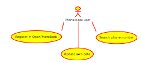
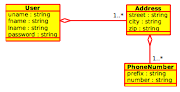
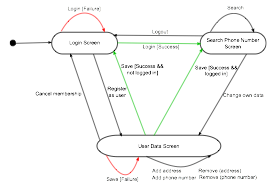
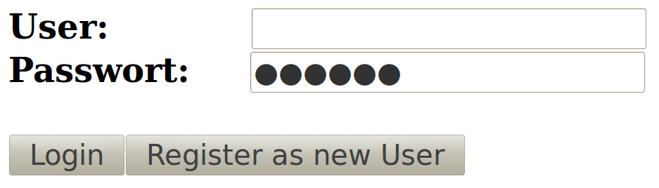
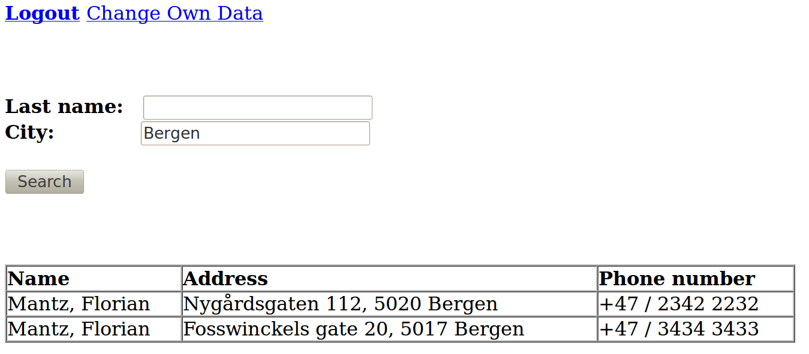
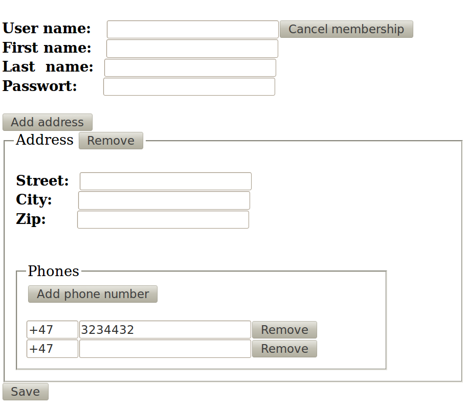

## DAT250: Programming Assignment 1

### High-level Design of an IoT Exchange Enterprise Application

In this assignment you will design an application that you will then implement using the Java EE platform in the subsequent programming assignment. The design and implementation of the Java EE application is to be undertaken in groups of 2-4 students.

The main requirements for the application is provided below. In addition, you will find an example design document for a phone book application.  Use this design document as a template for your own design document.

Each group is required to give a short presentation of their design document (see the course canvas for details), and also submit their design document in PDF format via canvas. It is recommended to structure the design document so that it can be used directly for the presentation.

For creating the design diagrams (use cases, domain model, and application flow) you may use tools such as

* Cacoo - https://cacoo.com/
* Umbrello UML Modeller - http://uml.sourceforge.net
* Draw IO - http://draw.io

or some other suitable tool you may know from earlier.

#### The OpenPhoneBook example

The OpenPhoneBook example application should help you to create a proper design document. Use it as template for the application that you are going to develop.

The OpenPhoneBook is an application for sharing phone numbers between registered users. Membership is free. Everyone can join the community by registering via a web form. Each logged-in user can search by last name as well as city for phone numbers of other registered users. Furthermore, each user can update his or her own information. Several addresses can be registered by each user and several phone numbers can be associated with an address. To keep it simple, mobile phone numbers are not handled in a special way.

##### Use Cases

The use cases give an overview of the basic functionality to be provided by the application. Usually each use case is subsequently redefined in a set of more precise diagrams. However, in this application this is not necessary since the use cases are relatively simple. Therefore only a single use case diagram (see figure below) is created. This should be sufficient also in the case of your application.

* **Register in OpenPhoneBook:** Everyone can register his addresses and phone numbers via a web form.
* **Update own data:** Users of the OpenPhoneBook can change the data via another web form, e.g., if they have moved and got a new phone number.
* **Search phone number:** Each user can search for phone numbers of other users via their last name and/or city.

##### Domain Model

The domain model shows the required concepts of the application and their relations. These are in this case *Users*, *Addresses* and *Phone Numbers*. These objects are stored in the database. Classes that encode application logic and helper classes are not part of the domain model.

The OpenPhoneBook application requires the concepts shown in the figure below. User names (uname) should be unique and passwords should be mandatory.

##### Application Flow Diagram

Screen transitions (in the web tier) should be modelled using a basic state machine. Each screen should be modelled as state. Each action (button/link which can be pressed) should be modelled as transition (arrow). A condition (guard) for a transition is written in brackets `[guard]`.

Furthermore, transitions which result from possible errors should be coloured red. If there is a red transition, then there should be also a green one covering the case when an error did not occur. Uncoloured transitions can be merged if it makes sense (see: `Add address`, `Add phone number`, `Remove (address)` and `Remove (phone number)` have been merged to a single transition.

The application consists of three screens. Only logged-in users can search for phone numbers of other users. The `User Data Screen` has multiple uses. It is used for registering as a new user and also for updating user data. Button  `Cancel membership` deletes the user from the phone book. If the button is pressed by an unregistered user, the user is also sent to the `Login Screen` (nothing has to be deleted).

##### User Screens

The user screen mock-ups is intended to prototype the application and give a better feeling how the application will work.

In `Login Screen` (see figure below) you can enter the application or be forwarded to a page were you can register as new user.

In `Search Phone Number Screen` (see figure below) each user can search by `Last name` and/or `City` for other users. Phone numbers found will appear in a table. If there is no result, a message `no matches` is shown instead of the table.

In `User Data Screen` (see figure below) a user can register as a new member, change his data or cancel his membership. Addresses are shown in a list. Each *Address* have a sublist containing all the phone numbers for the address. The data is validated when pressing the save button. It is checked that each set of data is complete. In addition, it is validated that the phone number is numerical. Furthermore, it is checked that the user adds add least one address and one phone number. Error messages shown are

* User data is not complete.
* Address <1> is not complete.
* Phone number <1> of Address <1> is not complete.
* Phone number <1> of Address <1> is not numeric.

At the design stage you may use any graphic program to create and sketch the mock-up screens. You may also use a mock-up tool, such as https://www.figma.com

#### The OpenIoT Exchange Application

Today still more embedded devices gets connected to the Internet, and a significant number of these devices provide sensing capabilities for collecting data (e.g., temperature, humidity, electricity metering) or actuator capabilities for control (e.g., switching light on/off, opening/closing valves).

The aim of the open IoT exchange application is to provide a service for Internet-of-things (IoT), where users can offer the data and capabilities of their IoT devices to other users. For instance, a user may have a temperature device that other users could be interested in obtaining data from. Potentially, users may also offer use of their devices for control purposes.

The requirements below may be incomplete, and it is your task to design a useful application. So it is important to try to find a proper balance in terms of the features that you want to support. The application should not be too complex and not too simple either. Keep in mind that you have to implement the application in the subsequent programming assignments.

You are given the following main requirements and assumptions concerning the application

1. Design an open IoT exchange where users can register their IoT devices, and where other users can search for IoT devices.
2. A device description should contain (at least) the following information:
    * Device name and picture
    * A list of tags/categories capturing capabilities of the device
    * A URL where the devices provide its data and/or service control service (eventually as a REST microservice)
    * Current status of the device (online, offline, available, not available, ...)
    * Feedback from other users that have used the service provided by the device
3. IoT devices (sensors or actuators) must be in a published status before they are available for other users
4. Users can filter devices by tags/categories and free text search.
5. Users must login before they can register devices, make devices available, and before they can access other devices.
6. Users can register for using a particular devices, and must then be approved by the owner of the device before it can be accessed.
7. A user should be able to see the list of devices the user is currently registered for, and the application may also provide list of the most popular devices.
8. Once a user de-registers from using a device, the user can provide some feedback on the service provided by the device.

An optional requirement, if you like to enhance the application. Extend the design so that users can purchase data and control services offered by other users. Note that you are not required to process payment gateways to complete the purchases.
